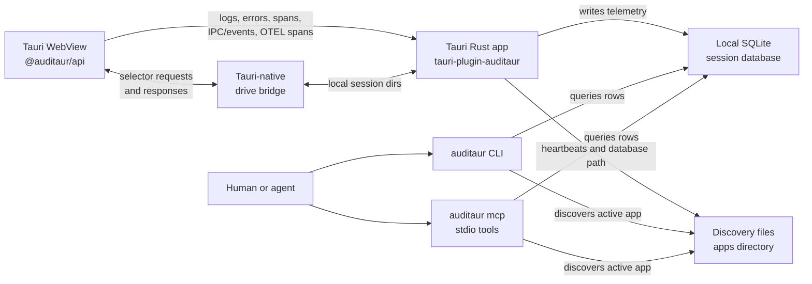

Auditaur is a local-first control plane for development telemetry. The app emits data, the Tauri plugin stores it locally, and tools inspect the same SQLite-backed session.

## Components

| Component | Role |
| --- | --- |
| `@auditaur/api` | Frontend SDK that captures console logs, errors, wrapped invokes, events, OpenTelemetry JS spans, and optional drive bridge actions. |
| `tauri-plugin-auditaur` | Tauri plugin that receives frontend batches, records Rust `tracing`, panic diagnostics, window lifecycle state, and writes local SQLite sessions. |
| SQLite session database | Per-session local store for logs, spans, frontend errors, IPC rows, events, windows, and related metadata. |
| Discovery files | Small heartbeat files that let CLI and MCP tools find active app sessions without a network service. |
| `auditaur` CLI | Human/script interface for health, logs, errors, traces, IPC, events, timeline, explain, bundle, drive, debug, and drill workflows. |
| `auditaur mcp` | Stdio MCP server exposing bounded JSON tool responses over the same local session data. |
| Tauri-native drive bridge | Optional dev/test bridge that lets `auditaur drive` run selector actions inside the app WebView. |

## Data flow

1. The Rust plugin starts with the app, creates a session database, and writes discovery heartbeats.
2. The frontend SDK exports telemetry batches to the plugin through the allowed Tauri command.
3. The plugin maps frontend records and Rust `tracing` records into SQLite tables.
4. CLI and MCP commands discover active sessions or use an explicit `--db` path.
5. Debugging commands correlate rows by session, trace id, span id, run id, window label, and timestamps.

## Local-first boundaries

Auditaur does not run a cloud service or network listener by default. Normal inspection is local file/database access through the CLI or stdio MCP server. Shareable outputs such as bundles, screenshots, snapshots, and issue drafts are explicit commands and should be reviewed before leaving the machine.

## Trace stitching

Frontend invoke spans and backend command spans are stitched with W3C trace context. The frontend wrapper sends `traceparent` plus the reserved compatibility argument; `auditaur_command` injects both carriers into app-owned Tauri commands and records the fields the tracing layer needs. This avoids timestamp or command-name heuristics when a trace crosses from WebView JavaScript into Rust.

## Drive bridge boundary

The drive bridge is opt-in and intended for development/test builds. It is not a browser engine replacement. `auditaur drive` writes local drive requests into the session directory, the frontend bridge executes selector actions in the WebView, and responses are written back for the CLI to read. Browser-debug compatibility flags are accepted only for older command lines and ignored by drive actions.
